# Architecture v5.0 - Diagramme de Séquence Détaillé

## 📊 Flux Complet de l'Analyse

```mermaid
sequenceDiagram
    participant User as 👤 Utilisateur
    participant Popup as 🖥️ Popup<br/>(popup.js)
    participant SW as ⚙️ Service Worker<br/>(service_worker.js)
    participant AC as 🎯 AnalysisCoordinator<br/>(AnalysisCoordinator.js)
    participant CS as 📄 Content Script<br/>(content-script.js)
    participant DE as 📦 DataExtractor<br/>(DataExtractor.js)
    participant AO as 🔬 AnalysisOrchestrator<br/>(AnalysisOrchestrator.js)
    participant Storage as 💾 Chrome Storage

    Note over User,Storage: 🚀 DÉMARRAGE DE L'ANALYSE

    User->>Popup: Clique "🚀 Analyse Complète v5.0"
    activate Popup
    Popup->>Popup: Désactive bouton<br/>Affiche "⏳ Analyse en cours..."
    Popup->>SW: chrome.runtime.sendMessage<br/>{action: 'analyzePageV5', tabId}

    activate SW
    Note over SW: IIFE async pattern<br/>(pas de channel closure)

    SW->>Popup: sendResponse({success: true, started: true})
    deactivate Popup

    SW->>Storage: Sauvegarde status<br/>{inProgress: true, startTime, tabId}
    SW->>AC: analysisCoordinator.analyzePage(tabId)

    activate AC

    Note over AC: 🔍 VÉRIFICATION DU CONTENT SCRIPT

    AC->>AC: chrome.tabs.get(tabId)
    AC->>AC: Vérifie URL<br/>(pas chrome://, about:, etc.)

    loop 5 tentatives max
        AC->>CS: Ping #1<br/>{action: 'ping'}
        CS-->>AC: ❌ Erreur: "Receiving end does not exist"

        Note over AC: Premier échec → Injection programmatique

        AC->>CS: chrome.scripting.executeScript<br/>12 scripts dans l'ordre
        Note over CS: Scripts injectés:<br/>1. DataExtractor.js<br/>2. ConfigurationManager.js<br/>3. ScoringEngine.js<br/>4. AnalyzerEndpoint.js<br/>5-10. 6 Endpoints<br/>11. AnalysisOrchestrator.js<br/>12. content-script.js

        AC->>AC: Attente 1000ms<br/>(initialisation des scripts)

        AC->>CS: Ping #2<br/>{action: 'ping'}
        activate CS
        CS->>AC: ✅ {status: 'ready'}
        deactivate CS
    end

    Note over AC,CS: 📊 EXTRACTION ET ANALYSE

    AC->>CS: chrome.tabs.sendMessage<br/>{action: 'analyzePagepData', options}
    activate CS

    CS->>CS: Vérifie flag isAnalyzing<br/>(évite doublons)
    CS->>CS: isAnalyzing = true

    CS->>CS: Vérifie classes disponibles<br/>(DataExtractor, AnalysisOrchestrator)

    CS->>DE: new DataExtractor()
    activate DE
    CS->>DE: extractAll()

    Note over DE: Extraction DOM:
    DE->>DE: extractMeta()
    DE->>DE: extractImages()
    DE->>DE: extractHeadings()
    DE->>DE: extractLinks()
    DE->>DE: extractAccessibility()
    DE->>DE: extractPerformance()

    DE-->>CS: pageData {url, meta, images, headings, links, accessibility, performance}
    deactivate DE

    CS->>AO: new AnalysisOrchestrator()
    activate AO
    CS->>AO: init()
    AO->>AO: Enregistre 6 endpoints

    CS->>AO: analyzePage(pageData)

    Note over AO: Analyse via 6 endpoints:
    AO->>AO: MetaAnalyzerEndpoint.analyze()
    AO->>AO: ImageAnalyzerEndpoint.analyze()
    AO->>AO: HeadingAnalyzerEndpoint.analyze()
    AO->>AO: LinkAnalyzerEndpoint.analyze()
    AO->>AO: AccessibilityAnalyzerEndpoint.analyze()
    AO->>AO: PerformanceAnalyzerEndpoint.analyze()

    AO->>AO: Calcule globalScore
    AO->>AO: Détermine level (A+, A, B, etc.)

    AO-->>CS: analysisResult {url, globalScore, level, analyses, timestamp}
    deactivate AO

    CS->>CS: isAnalyzing = false
    CS-->>AC: {success: true, data: analysisResult}
    deactivate CS

    Note over AC,SW: 💾 SAUVEGARDE ET NOTIFICATION

    AC->>AC: cacheResult(url, result)
    AC->>Storage: Sauvegarde dans chrome.storage.local<br/>analysis_{url}: {result, timestamp}
    AC-->>SW: analysisResult
    deactivate AC

    SW->>Storage: Sauvegarde status<br/>{inProgress: false, completed: true, result}

    SW->>Popup: chrome.runtime.sendMessage<br/>{action: 'analysisV5Complete', result: {url, globalScore, level, timestamp}}
    deactivate SW

    Note over Popup: 🎉 AFFICHAGE DU RÉSULTAT

    activate Popup
    Popup->>Popup: chrome.runtime.onMessage.addListener
    Popup->>Popup: Réactive bouton
    Popup->>Popup: Affiche succès:<br/>✓ Analyse terminée!<br/>Score: X/5 (Level)<br/>📊 Voir le Dashboard

    User->>Popup: Clique "📊 Voir le Dashboard"
    Popup->>Popup: chrome.tabs.create<br/>dashboard.html?url=...
    deactivate Popup
```



## 🔑 Points Clés de l'Architecture

### 1. **IIFE Async Pattern** (Service Worker)
```javascript
// ❌ AVANT (channel closure)
chrome.runtime.onMessage.addListener(async (request, sender, sendResponse) => {
  const result = await longOperation();
  sendResponse(result); // ⚠️ Canal déjà fermé!
});

// ✅ APRÈS (canal ouvert)
chrome.runtime.onMessage.addListener((request, sender, sendResponse) => {
  (async () => {
    const result = await longOperation();
    sendResponse(result); // ✅ Canal encore ouvert
  })();
  return true; // Indique réponse asynchrone
});
```

### 2. **Architecture Événementielle** (Évite Message Port Timeout)
```javascript
// SERVICE WORKER
sendResponse({success: true, started: true}); // Réponse immédiate
// ... puis analyse en arrière-plan ...
chrome.runtime.sendMessage({action: 'analysisV5Complete', result}); // Notification

// POPUP
chrome.runtime.onMessage.addListener((message) => {
  if (message.action === 'analysisV5Complete') {
    // Affiche le résultat
  }
});
```

### 3. **Injection Programmatique** (Fallback si page déjà chargée)
```javascript
// Si ping échoue → Injection des 12 scripts
await chrome.scripting.executeScript({
  target: { tabId },
  files: [
    'api/extractors/DataExtractor.js',
    'api/config/ConfigurationManager.js',
    // ... 10 autres scripts ...
    'content-script.js'
  ]
});
await new Promise(resolve => setTimeout(resolve, 1000)); // Attente initialisation
```

### 4. **Flag isAnalyzing** (Évite analyses multiples)
```javascript
// CONTENT SCRIPT
let isAnalyzing = false;

async function handleAnalyzePageRequest(sendResponse) {
  if (isAnalyzing) {
    sendResponse({success: false, error: 'Analysis already in progress'});
    return;
  }

  try {
    isAnalyzing = true;
    // ... analyse ...
  } finally {
    isAnalyzing = false; // ⚠️ Toujours réinitialiser
  }
}
```

## 🏗️ Structure des Données

### Message: analyzePageV5
```javascript
{
  action: 'analyzePageV5',
  tabId: 123
}
```

### Message: analyzePagepData
```javascript
{
  action: 'analyzePagepData',
  options: {
    // Configuration optionnelle
  }
}
```

### Response: analysisResult
```javascript
{
  url: 'https://example.com',
  timestamp: '2026-01-19T12:00:00.000Z',
  globalScore: 3.31,
  level: 'B',
  analyses: {
    meta: { score, issues, recommendations },
    images: { score, issues, recommendations },
    headings: { score, issues, recommendations },
    links: { score, issues, recommendations },
    accessibility: { score, issues, recommendations },
    performance: { score, issues, recommendations }
  },
  issues: [...],
  recommendations: [...]
}
```

### Notification: analysisV5Complete
```javascript
{
  action: 'analysisV5Complete',
  tabId: 123,
  result: {
    url: 'https://example.com',
    globalScore: 3.31,
    level: 'B',
    timestamp: '2026-01-19T12:00:00.000Z'
  }
}
```

## ⏱️ Timing et Performance

| Étape | Durée Moyenne | Notes |
|-------|---------------|-------|
| Popup → Service Worker | ~10ms | Synchrone |
| Service Worker → Response | ~20ms | Réponse immédiate |
| Ping Content Script | ~50ms x 5 | Jusqu'à 5 tentatives |
| Injection Programmatique | ~500ms | Si nécessaire |
| Attente Initialisation | 1000ms | Après injection |
| Extraction DOM | ~200-500ms | Selon taille page |
| Analyse Endpoints | ~300-800ms | 6 endpoints |
| Sauvegarde Storage | ~50ms | Asynchrone |
| Notification Popup | ~10ms | Message broadcast |
| **TOTAL** | **2-4 secondes** | Dépend de la page |

## 🛡️ Gestion des Erreurs

### Erreur: Content Script Not Ready
```
[AnalysisCoordinator] Ping attempt 1/5 failed: Could not establish connection
→ Injection programmatique des scripts
→ Attente 1000ms
→ Retry ping
```

### Erreur: Protected URL
```
[AnalysisCoordinator] Tab URL: chrome://extensions/
→ throw new Error('Cannot analyze browser internal pages')
→ Service Worker envoie analysisV5Error
→ Popup affiche l'erreur
```

### Erreur: Analysis Already in Progress
```
[Content Script] isAnalyzing = true
→ sendResponse({success: false, error: 'Analysis already in progress'})
```

### Erreur: Classes Not Loaded
```
[Content Script] typeof DataExtractor === 'undefined'
→ throw new Error('Required classes not loaded. Please reload the page.')
```

## 📝 Commits Chronologiques

1. **`2861af2`** - Load all API scripts via manifest.json
2. **`58bf38b`** - Handle dual ARIA data formats
3. **`93e2d3e`** - Add content script readiness check
4. **`a11b7ff`** - Programmatically inject content script if not present
5. **`c4bcf24`** - Use event-driven architecture to prevent timeout
6. **`f60f1d1`** - Improve injection with URL validation
7. **`88f80f6`** - Use IIFE async pattern to prevent channel closure

---

**✅ RÉSULTAT:** Architecture v5.0 fonctionnelle avec affichage du bouton Dashboard
