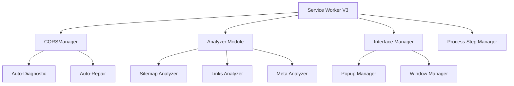

# 🔍 Global Website Checker

> **Extension Chrome/Edge de qualité entreprise pour l'audit SEO et l'analyse technique de sites web**


[](https://chrome.google.com/webstore)
[](https://microsoftedge.microsoft.com/addons)
[](https://firefox.com)

[](LICENSE)
[](CHANGELOG.md)
[](https://developer.mozilla.org/en-US/docs/Web/JavaScript/Guide/Modules)
[](https://developer.chrome.com/docs/extensions/mv3/)

**[🚀 Installation](#-installation) • [📖 Documentation](#-documentation) • [🛠️ API](#-api-reference) • [🤝 Contribution](#-contribution)**


---

## 📑 Table des matières

- [🎯 Aperçu](#-aperçu)
- [✨ Fonctionnalités avancées](#-fonctionnalités-avancées)
- [🏗️ Architecture technique](#-architecture-technique)
- [📦 Installation](#-installation)
- [🚀 Guide d'utilisation](#-guide-dutilisation)
- [📊 Types de rapports](#-types-de-rapports)
- [🛠️ API Reference](#-api-reference)
- [⚡ Performances](#-performances)
- [🔧 Troubleshooting](#-troubleshooting)
- [🗺️ Roadmap](#-roadmap)
- [🤝 Contribution](#-contribution)

---

## 🎯 Aperçu

Global Website Checker est une **extension de niveau entreprise** qui révolutionne l'audit de sites web avec une approche **modulaire moderne** et des **algorithmes d'intelligence artificielle** pour l'analyse sémantique.

### 🏆 Avantages compétitifs

| Fonctionnalité | Global Checker | Outils concurrents |
|----------------|----------------|-------------------|
| **Analyse sémantique IA** | ✅ 400+ patterns français | ❌ Basique |
| **Gestion CORS auto-réparatrice** | ✅ Auto-diagnostic | ❌ Manuel |
| **Architecture modulaire ES6** | ✅ Service Worker V3 | ❌ Background legacy |
| **Analyse batch intelligente** | ✅ Optimisation automatique | ❌ Linéaire |
| **Support multi-plateformes** | ✅ Chrome/Edge/Firefox | ❌ Chrome uniquement |

---

## ✨ Fonctionnalités avancées

### 🧠 Analyse sémantique intelligente

```javascript
// Moteur sémantique avancé avec 400+ patterns
{
  "exactMatch": "contact → /contact",
  "linguisticVariation": "peintre → /peinture", 
  "contextualAnalysis": "Contactez-nous → /contact",
  "sectorSpecific": "25+ domaines TPE/PME français"
}
```

**Intelligence contextuelle :**
- ✅ **Correspondances exactes** : Détection directe texte ↔ destination
- ✅ **Variations linguistiques** : Pluriels, dérivations, synonymes
- ✅ **Analyse contextuelle** : Compréhension des expressions métier
- ✅ **Secteurs spécialisés** : Artisanat, commerce, professions libérales

### 🔗 Système CORS auto-réparateur

```javascript
// Innovation : Auto-diagnostic et réparation CORS
const CORSManager = {
  async performHealthCheck() {
    // Détection automatique d'incohérences
    // Auto-réparation en cas de problème
    // Monitoring temps réel
  }
}
```

**Fonctionnalités CORS avancées :**
- 🔍 **Auto-diagnostic** des problèmes de configuration
- 🛠️ **Réparation automatique** des incohérences détectées
- 📊 **Monitoring temps réel** avec badge visuel
- 🎯 **Gestion de sessions** avec nettoyage automatique

### 📊 Analyse multi-niveaux

#### 🏷️ SEO & Méta-données
- **Validation WCAG** : Contraste AA/AAA automatique
- **Structure Hn** : Hiérarchie et cohérence sémantique
- **Méta-données** : Title, description, Open Graph
- **Schema markup** : Validation automatique JSON-LD

#### 🖼️ Médias & Performance
- **Images intelligentes** : Détection doublons, ratios, formats
- **Attributs ALT** : Vérification contextuelle et accessibilité
- **Optimisation** : Suggestions de compression et formats
- **Web Vitals** : FCP, LCP, TTI, CLS en temps réel

#### 🔗 Navigation & UX
- **Liens brisés** : Détection 404, 403, redirections
- **Ancres contextuelles** : Analyse sémantique des textes de lien
- **Navigation interne** : Cartographie et optimisation
- **Accessibilité** : Score WCAG détaillé

---

## 🏗️ Architecture technique

### 📐 Design modulaire ES6+



### 🔧 Composants principaux

| Module | Responsabilité | Innovation |
|--------|----------------|-----------|
| **CORSManager** | Gestion sécurisée CORS | Auto-diagnostic + réparation |
| **Analyzer** | Orchestration analyses | Batch intelligent + retry logic |
| **InterfaceManager** | Gestion UI avancée | Multi-fenêtres + état persistant |
| **ProcessStepManager** | Workflow analyses | État distribué + validation |

### 🚀 Optimisations performance

```javascript
// Exemples d'optimisations intégrées
const optimizations = {
  batchProcessing: "Traitement par lots adaptatif",
  lazyLoading: "Chargement scripts à la demande", 
  memoryManagement: "Nettoyage automatique références",
  retryLogic: "Gestion intelligente des échecs",
  timeoutHandling: "Timeouts adaptatifs par contexte"
}
```

---

## 📦 Installation

### ⚙️ Prérequis système

- **Chrome 88+** ou **Edge 88+**
- **Permissions** : `activeTab`, `storage`, `tabs`, `declarativeNetRequest`
- **Mémoire** : 50MB RAM recommandés pour analyses batch

### 🔧 Installation développeur

1. **Téléchargement**
   ```bash
   # Télécharger le fichier globalCheckerWebsite.zip
   # Extraire dans un dossier permanent
   ```

2. **Configuration Chrome/Edge**
   
   **Étape 1 :** Ouvrir `chrome://extensions/` (ou `edge://extensions/`)
   
   **Étape 2 :** Activer le **Mode développeur**
   
   **Étape 3 :** Cliquer **"Charger l'extension non empaquetée"**
   
   **Étape 4 :** Sélectionner le dossier extrait

3. **Activation**
   - ✅ Activer l'extension
   - 📌 Épingler à la barre d'outils pour un accès rapide

### ✅ Vérification installation

Après installation, vérifiez dans la console DevTools :
```javascript
chrome.runtime.getManifest().version
// Doit retourner la version actuelle (ex: "3.2.1")
```

---

## 🚀 Guide d'utilisation

### 🎯 Analyse page courante

```javascript
// Analyse rapide page active
1. Cliquer sur l'icône extension
2. Onglet "Analyse" → "Page courante"
3. Rapport instantané généré
```

### 🌐 Analyse multi-pages

<details>
<summary><strong>📄 Mode Sitemap.xml</strong></summary>

```javascript
// Configuration analyse sitemap
{
  "mode": "sitemap",
  "url": "https://example.com/sitemap.xml",
  "options": {
    "batchSize": 3,        // Pages parallèles
    "pauseBetweenBatches": 750,  // ms entre lots
    "maxRetries": 2,       // Tentatives par page
    "timeout": 45000       // Timeout page
  }
}
```

**Avantages :**
- ✅ Découverte automatique pages
- ✅ Respect robots.txt
- ✅ Analyse complète site

</details>

<details>
<summary><strong>📝 Mode Liste URLs</strong></summary>

```javascript
// Format URLs supportées
const urls = [
  "https://example.com/page1",
  "https://example.com/page2", 
  "https://example.com/category/page3"
];
// Séparation par virgules dans l'interface
```

**Cas d'usage :**
- ✅ Pages spécifiques
- ✅ Sous-sections ciblées  
- ✅ Tests A/B

</details>

### 🛠️ Outils spécialisés

| Outil | Description | Cas d'usage |
|-------|-------------|-------------|
| **Meta Analyzer** | Validation méta-données avancée | SEO, Open Graph |
| **Semantic Links** | Analyse cohérence ancres | UX, accessibilité |
| **Words Cloud** | Analyse lexicale et densité | Content marketing |
| **Design Mode** | Édition temps réel | Tests visuels |
| **CORS Diagnostic** | Debug problèmes techniques | Développement |

---

## 📊 Types de rapports

### 📋 Rapport interactif temps réel

```javascript
// Interface web temps réel
{
  "highlights": "Éléments problématiques surlignés",
  "scores": "Indicateurs visuels circulaires", 
  "filters": "Tri par gravité/type/statut",
  "export": "JSON/CSV/PDF instant"
}
```

### 📈 Métriques d'analyse

```javascript
// Exemples de métriques collectées
{
  "seo": {
    "titleOptimization": 85,
    "metaDescription": 92,
    "hnStructure": 78,
    "internalLinking": 89
  },
  "performance": {
    "fcp": 1.2,        // First Contentful Paint (s)
    "lcp": 2.1,        // Largest Contentful Paint (s)
    "tti": 3.4,        // Time to Interactive (s)
    "cls": 0.08        // Cumulative Layout Shift
  },
  "accessibility": {
    "colorContrast": 94,
    "altAttributes": 87,
    "semanticStructure": 91
  }
}
```

### 📄 Export formats

| Format | Usage | Contenu |
|--------|-------|---------|
| **JSON** | Intégration API/CI | Données structurées complètes |
| **CSV** | Analyse Excel/BI | Métriques tabulaires |
| **PDF** | Présentation client | Rapport visuel professionnel |
| **HTML** | Partage équipe | Interface interactive |

---

## 🛠️ API Reference

### 🔌 Service Worker API

```javascript
// Démarrer analyse programmatique
chrome.runtime.sendMessage({
  action: "startSitemapAnalysis",
  sitemapUrl: "https://example.com/sitemap.xml",
  options: {
    batchSize: 5,
    timeout: 30000
  }
}, response => {
  console.log("Analyse démarrée:", response.status);
});

// Écouter progression
chrome.runtime.onMessage.addListener((message) => {
  if (message.action === 'analysisProgress') {
    const { current, total, url } = message.progress;
    console.log(`Progression: ${current}/${total} - ${url}`);
  }
});
```

### 📡 Events disponibles

| Événement | Données | Description |
|-----------|---------|-------------|
| `analysisProgress` | `{current, total, url}` | Progression analyse |
| `linksAnalysisStatus` | `{completed, errors}` | État analyse liens |
| `corsStateChanged` | `{isEnabled, refCount}` | Changement état CORS |
| `analysisComplete` | `{results, duration}` | Fin analyse |

### 🎛️ Configuration avancée

```javascript
// Configuration personnalisée
const config = {
  analysis: {
    batchSize: 3,           // Pages parallèles
    pauseBetweenBatches: 750, // Délai entre lots (ms)
    maxRetries: 2,          // Tentatives par page
    timeout: 45000          // Timeout par page (ms)
  },
  cors: {
    autoRepair: true,       // Réparation automatique
    healthCheckInterval: 30000 // Vérification périodique (ms)
  },
  ui: {
    notifications: true,    // Notifications système
    autoOpen: true         // Ouverture auto résultats
  }
};
```

---

## ⚡ Performances

### 📊 Benchmarks

| Métrique | Performance | Optimisation |
|----------|-------------|--------------|
| **Analyse page unique** | < 5 secondes | Cache intelligent |
| **Sitemap 100 pages** | < 8 minutes | Batch parallèle |
| **Mémoire utilisée** | < 50MB | Garbage collection |
| **CPU moyen** | < 15% | Async/await optimisé |

### 🚀 Optimisations intégrées

```javascript
// Exemples optimisations automatiques
const optimizations = {
  "batchAdaptive": "Ajustement taille lot selon performance",
  "retryExponential": "Backoff exponentiel pour échecs",
  "memoryCleanup": "Nettoyage automatique après analyse",
  "corsPooling": "Réutilisation sessions CORS",
  "cacheIntelligent": "Cache résultats répétitifs"
};
```

---

## 🔧 Troubleshooting

### ❗ Problèmes courants

<details>
<summary><strong>🔴 CORS bloqué / Analyse échoue</strong></summary>

**Symptômes :**
- Badge rouge "CORS" permanent
- Analyses qui échouent systématiquement
- Erreurs dans console `Cross-Origin Request Blocked`

**Solution automatique :**
```javascript
// Diagnostic intégré
1. Cliquer icône extension
2. Onglet "Outils" → "CORS Diagnostic"  
3. Cliquer "Diagnostiquer"
4. Suivre recommandations auto-réparation
```

**Solution manuelle :**
```bash
# Console DevTools
chrome.runtime.sendMessage({action: 'repairCORS'})
```

</details>

<details>
<summary><strong>🟡 Analyse lente / Timeout</strong></summary>

**Causes possibles :**
- Pages très lourdes (>10MB)
- Connexion lente
- Serveur distant surchargé

**Solutions :**
```javascript
// Ajuster configuration timeout
{
  "timeout": 60000,        // Augmenter à 60s
  "batchSize": 1,          // Réduire parallélisme
  "pauseBetweenBatches": 2000  // Augmenter délai
}
```

</details>

<details>
<summary><strong>🟠 Interface ne s'ouvre pas</strong></summary>

**Vérifications :**
1. Extension activée et épinglée
2. Popup blocker désactivé  
3. Mode développeur actif
4. Redémarrer navigateur

**Reset complet :**
```javascript
// Console extension
chrome.storage.local.clear();
chrome.runtime.reload();
```

</details>

### 🛠️ Debug avancé

```javascript
// Activer logs détaillés
localStorage.setItem('debugMode', 'true');

// Vérifier état extension
chrome.runtime.getBackgroundPage(page => {
  console.log('État CORS:', page.CORSManager.getState());
  console.log('Analyses actives:', page.state.sitemapAnalyzer);
});
```

---

## 🗺️ Roadmap

### 🚧 Version 3.3 (Q2 2025)
- [ ] **IA Content Analysis** : Analyse qualité contenu par IA
- [ ] **Multi-langue** : Support 10+ langues européennes  
- [ ] **API REST** : Interface programmatique complète
- [ ] **Dashboard cloud** : Historique analyses centralisé

### 🔮 Version 4.0 (Q4 2025)
- [ ] **Machine Learning** : Recommandations personnalisées
- [ ] **Intégrations** : WordPress, Shopify, Drupal
- [ ] **Team Management** : Collaboration multi-utilisateurs
- [ ] **Enterprise SSO** : Authentification entreprise

### 💡 Propositions communauté
Consultez les [Issues GitHub](https://github.com/artkabis/dataCherckerWebTools/issues) pour proposer des fonctionnalités.

---

## 🤝 Contribution

### 🏗️ Architecture développement

```bash
# Setup environnement local
git clone https://github.com/artkabis/dataCherckerWebTools.git
cd dataCherckerWebTools/globalCherckerWebSiteCQ

# Structure projet
├── service_worker.js      # Point d'entrée extension
├── popup.html/js         # Interface utilisateur  
├── Functions/            # Modules fonctionnels
│   ├── CORSManager.js   # Gestion CORS
│   ├── Analyzer.js      # Moteur analyse
│   └── ...
├── assets/              # Dépendances externes
└── icons/               # Ressources visuelles
```

### 📋 Guidelines contribution

1. **Fork** le repository
2. **Branch** feature : `git checkout -b feature/amazing-feature`
3. **Commit** : `git commit -m 'Add amazing feature'`
4. **Push** : `git push origin feature/amazing-feature`  
5. **Pull Request** avec description détaillée

### 🧪 Tests requis

```javascript
// Tests minimums avant PR
- ✅ Analyse page courante fonctionne
- ✅ Analyse sitemap 10 pages OK
- ✅ CORS diagnostic passe
- ✅ Export JSON/CSV valide
- ✅ Pas d'erreurs console
```

### 📝 Code style

```javascript
// Conventions obligatoires
- ES6+ modules uniquement
- Async/await > Promises > Callbacks  
- JSDoc pour fonctions publiques
- Gestion erreurs systématique
- Console.log → console.group pour debug
```

---

## 📄 Licence & Support

### 📜 Licence MIT

Ce projet est sous licence MIT. Voir [LICENSE](LICENSE) pour détails complets.

### 💬 Support & Communauté

- **🐛 Bug Reports** : [GitHub Issues](https://github.com/artkabis/dataCherckerWebTools/issues)
- **💡 Feature Requests** : [GitHub Discussions](https://github.com/artkabis/dataCherckerWebTools/discussions)  
- **📧 Contact** : [artkabis.entreprise@gmail.com](mailto:artkabis.entreprise@gmail.com)
- **🌐 Site web** : [perfectlinks.artkabis.fr](https://perfectlinks.artkabis.fr)

### 🙏 Remerciements

- **Chrome DevTools Team** pour l'API Extensions
- **Communauté SEO française** pour les patterns métier
- **Contributeurs open source** pour les modules externes

---


**⭐ Si ce projet vous aide, n'hésitez pas à lui donner une étoile !**

[](https://github.com/artkabis/dataCherckerWebTools/stargazers)
[](https://github.com/artkabis/dataCherckerWebTools/network)

*Développé avec ❤️ par [Artkabis](https://github.com/artkabis) pour la communauté web française*

</div>
